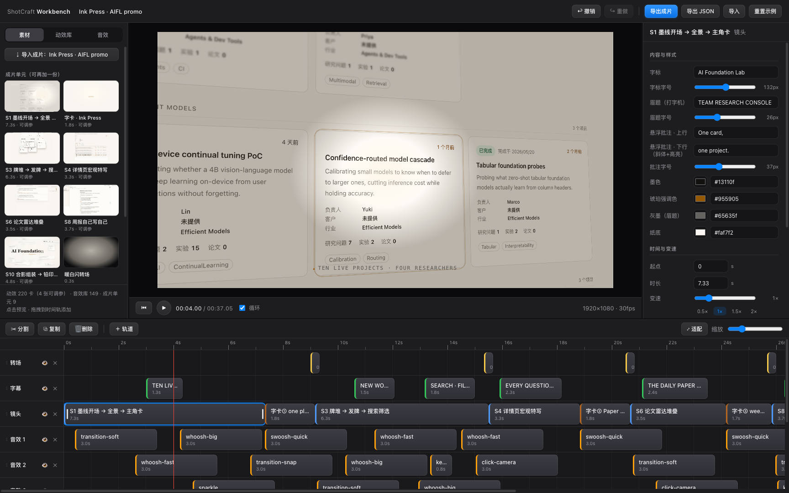

<div align="center">

<picture>
  <source media="(prefers-color-scheme: dark)" srcset="./assets/brand/logo-mark-reverse.svg">
  <source media="(prefers-color-scheme: light)" srcset="./assets/brand/logo-mark.svg">
  
</picture>

<h1>video-shotcraft</h1>

[](https://github.com/Vincentwei1021/video-shotcraft/stargazers)
[](https://atomgit.com/VincentWei/video-shotcraft)
[](https://vincentwei1021.github.io/video-shotcraft/)

<a href="https://trendshift.io/repositories/88911?utm_source=trendshift-badge&utm_medium=badge&utm_campaign=badge-trendshift-88911" target="_blank" rel="noopener noreferrer"></a>
<a href="https://trendshift.io/repositories/88911?utm_source=trendshift-badge&utm_medium=badge&utm_campaign=badge-trendshift-88911" target="_blank" rel="noopener noreferrer"></a>

**映画のような製品動画を制作するためのエージェントスキル：157 種類のショットレシピカード · 214 種類のスタイル · 214 本のモーションプレビュー · 実制作に対応したテンプレート**

[English](README.md) | [中文](README_CN.md) | [日本語](README_JA.md)

</div>

**video-shotcraft** は、Claude Code や Codex をモーションデザインスタジオに
変える AI エージェントスキルです。製品を指定するだけで、ストーリーボード、アニメーション、
サウンドデザインを行い、[Remotion](https://www.remotion.dev/) を使って映画のようなプロモーション、
マーケティング、ローンチ、デモ動画を制作します。実際のページキャプチャ、2.5D カメラワーク、
ビートに同期したカット、映画品質の SFX も含まれます。

🖼️ [**ライブ Gallery で 214 本のモーションプレビューをすべて見る »**](https://vincentwei1021.github.io/video-shotcraft/)

## ✨ 最新情報

> [!IMPORTANT]
> ### 🔥 2026-08 · シリーズ新作：ナレーション動画版 **video-talkcraft**
> [**video-talkcraft**](https://github.com/Vincentwei1021/video-talkcraft) は
> 本シリーズのナレーション動画版です。原稿と完成したボイスオーバーを渡すと、
> すべてのモーションビートが音声にロックされます——ローカルで単語レベルの
> タイムスタンプを整列（1 文字あたりの誤差は中央値 20–40 ms）、
> **モーションレシピカード 78 枚**、7 層のアンチ・スライドショー ショット
> システム（連続カメラカーブ、パララックス面、idle/yield ライフサイクル、
> 呼吸する環境レイヤー）、ベタ切り字幕、3 段階の QA ゲート。レシピカード +
> Remotion のワークフローは同じまま、ナレーション向けに再調整しました。
>
> 🎙️ [**プロジェクトページ »**](https://github.com/Vincentwei1021/video-talkcraft) ·
> 🖼️ [**78 本のナレーション用モーションプレビューを見る »**](https://vincentwei1021.github.io/video-talkcraft/)

> [!IMPORTANT]
> ### 🛠️ 2026-09 · 新機能：**モーションワークベンチ**——納品後もブラウザで編集を続ける
> 納品後、skill が CapCut 風のブラウザワークベンチを自動で開きます
> （`node workbench/scripts/open.mjs <project>`）。映像は元のショット構成どおりに
> ショット / トランジション / 字幕 / SFX のトラックへ分解され、任意のショットを選んで
> 文言・フォントサイズ・色をスキーマ駆動のインスペクタで編集、クリップの移動・トリム・
> 速度変更、**216 本の demo モーション**をライブラリからドラッグして追加、そのまま
> Remotion で書き出せます。プレビューとレンダリングはフレーム単位で一致（ピクセル比較で検証済み）。
>
> 
>
> 🧭 [**ワークベンチガイド：各パネルと機能をスクリーンショット付きで »**](workbench/GUIDE.md)（中国語）·
> 🔌 [**連携コントラクト »**](references/workbench.md)

- 🌟 **2026-08 · ショットレシピカード 48 枚を新規追加**——ライブラリは 104 枚
  から **152 カード / 209 プレビュー**に拡充。209 候補から参照映像との
  フレーム単位比較レビューを 8 ラウンド重ねて厳選し、既存カテゴリに統合：
  完全なレシピカード + ネイティブ Remotion コンポーネント
  （`demos/<カテゴリ>/<カード名>/<Component>.tsx`、正規化された進行度 t で
  駆動する決定論的レンダリング）+ モーションプレビュー。すべてテンプレート化済み
  （ニュートラルなプレースホルダー文言 + 差し替え可能な `ACCENT` カラー変数）。
- 🎞️ **2026-08 · 剪映（CapCut 中国版）プロジェクト書き出し**——完成映像を編集
  可能な剪映ドラフトとして書き出し：プレートはショット単位に分割（変速・
  並べ替え・カラー調整可）、字幕はネイティブテキストトラックに再構築
  （文言・サイズ・色を編集可）、SFX/BGM は独立音声トラック。macOS 版
  剪映 11.2 で実機検証済み。詳細は
  [references/jianying-export.md](references/jianying-export.md)。

## 🎬 ショーケース

以下の 38 秒間の Gallery 紹介動画も、このスキルで制作されました。
ストーリーボード、ショットの実装、サウンドデザインのすべてを、エージェントが
ツールキットの手法に沿って行っています。

https://github.com/user-attachments/assets/cba2df8a-4b2e-4247-bace-d0b1dea9c2bd

▶️ [YouTube で HD 版を見る](https://youtu.be/gcVvRM_P3SM)

> すべてのショットカードとモーションプレビューをオンラインで閲覧：**[Gallery](https://vincentwei1021.github.io/video-shotcraft/)**
> — 検索、絞り込み、バリエーションの切り替え、選択したショットカード名のコピーが可能です。

## 🚀 クイックスタート

**最も簡単な方法は、リポジトリのリンクをエージェントに渡すことです。**
Claude Code、Codex、または同様のエージェントで、次のように伝えます。

```text
Install this skill for me: https://github.com/Vincentwei1021/video-shotcraft
```

エージェントがリポジトリをクローンし、スキルディレクトリにリンクします。または、
[skills](https://skills.sh/) CLI を使うか、手動でインストールします。

```bash
npx skills add Vincentwei1021/video-shotcraft
```

```bash
git clone https://github.com/Vincentwei1021/video-shotcraft.git
cd video-shotcraft
ln -s "$(pwd)" ~/.claude/skills/video-shotcraft   # Claude Code
# or
ln -s "$(pwd)" ~/.codex/skills/video-shotcraft    # Codex
```

インストール後は、次のように依頼できます。

```text
Use video-shotcraft to create a promo for my desktop product.
Use the deck-deal-flyin and row-embed shot cards to present this feature.
Design a product close-up inspired by spotlight-hero-card.
```

ショットカードを指定しない場合、スキルは最初に内蔵の動画テンプレートを
紹介し、それを使うか確認します。作業を始める前に
[Gallery](https://vincentwei1021.github.io/video-shotcraft/) でショットを選ぶこともできます。

## 📼 動画テンプレート：Ink Press

スキルには、検証済みの完全なプロモーションテンプレート **Ink Press** が付属します。
長さ 36.2 秒、1920×1080、30fps、紙・インク・アンバー調の 10 ショットで構成され、2.5D の
実ページカメラワーク、タイトルカード、トランジション、細部まで調整された映画品質の
SFX が含まれます。

https://github.com/user-attachments/assets/4cf5af51-98f3-4af2-8ab2-7267f470513d

▶️ [YouTube で HD 版を見る](https://youtu.be/iShab28B_ak)

使用するには、エージェントに次のように伝えるだけです。

```text
Use video-shotcraft to make a promo for my product with the Ink Press template.
```

エージェントが製品のスクリーンショット、コピー、ブランド要素に差し替えて
同じ品質を再現します。完成した動画を得るための、最も速く確実な方法です。

> 今後、さらに多くのテンプレートが追加される予定です。

### Headless / CI に関する注意事項

ヘッドレスの Linux サーバー（検証環境：2 コア、Node 22）でレンダリングする際、
次の 3 つの問題に遭遇します。いずれもフラグ 1 つで解決できます。

1. **並列数の上限** — 低コアのマシンでは `remotion still/render` が
   "Maximum for --concurrency is 2" というエラーで失敗します。対処:
   `--concurrency=1` を指定します。
2. **旧 Headless モードの廃止** — 最近の Chrome/Chromium は旧 headless モードを
   廃止したため、Remotion にシステムの chromium を指定すると起動に失敗します。
   対処: フル版 Chrome ではなく chrome-headless-shell バイナリを使用します。
3. **CDN への接続遮断** — remotion.media に到達できない環境では、
   headless-shell の自動ダウンロードが失敗します。対処:
   `--browser-executable=<ローカルの chrome-headless-shell のパス>` を指定します。

この 3 つのフラグを設定すれば、同梱テンプレートのレンダリングが動作します。

## 📦 収録内容

| 内容 | 説明 |
| --- | --- |
| 157 種類のショットレシピカード | 目的、エネルギー、推奨時間、パラメータ、実装上の注意点、既知の落とし穴 |
| 214 本のモーションプレビュー | 214 種類のスタイルを網羅し、オンライン Gallery で検索と絞り込みが可能 |
| Remotion 実装 | 各カードの実際のイージングとタイミングパラメータを含む、調整済みの TSX デモ |
| 完全な動画テンプレート | 検証済みの 36.2 秒、1920×1080、30fps、10 ショットの製品プロモーション |
| コンポーネントとアセット | 2.5D ページカメラ、キャプション、フラッシュカット、数字ロール、SFX、キャプチャスクリプト |
| 制作手法 | キャプチャ、ビジュアルディレクション、ストーリーボード、サウンドデザイン、ビート同期、最終 QA |
| 剪映プロジェクト書き出し | 完成映像を剪映（CapCut 中国版）で継続編集——ショット変速・字幕・音声トラックを編集可（macOS 11.2 実機検証済み） |
| モーションワークベンチ | 納品後に開くブラウザのタイムラインエディタ：映像をトラックに分解、公開されたショット属性の編集、再タイミング、216 個の demo モーションのドラッグ投入、Remotion 書き出し |

このツールキットは主に Web およびデスクトップ製品のプロモーションを対象としていますが、
各ショットカードは機能デモ、ブランド映像、ローンチ動画、
その他のモーション制作にも利用できます。

## 🗂 リポジトリ構成

```text
video-shotcraft/
├── SKILL.md                 # Agent entry point and core production rules
├── references/
│   ├── pipeline.md          # End-to-end production workflow
│   ├── shots/               # 157 shot recipe cards
│   ├── sequences/           # Reusable full-video structures and sequence patterns
│   ├── aesthetic-rules.md   # Visual QA criteria
│   ├── music-beat-sync.md   # BGM analysis and beat-sync methodology
│   ├── sound-design.md      # Sound-design guidance and examples
│   ├── jianying-export.md   # JianYing (CapCut CN) project-export guide
│   └── workbench.md         # Motion workbench: manifest contract + editability rules
├── demos/                   # Remotion reference implementations for shot cards
├── gallery/                 # Static motion-preview Gallery
├── template/                # Runnable complete video template
├── jianying-export/         # JianYing draft installers (mac tested / win untested)
├── workbench/               # Post-delivery motion workbench (Vite + Remotion Player)
└── assets/
    ├── lib/                 # Reusable Remotion components
    ├── scripts/             # Page-asset capture scripts
    └── audio/               # 音声アセット
        ├── bgm/             # BGM 候補 5 曲
        └── sfx/<カテゴリ>/  # 効果音 149 個、シーン別 16 カテゴリ
```

完全なワークフローと実装要件については、[SKILL.md](SKILL.md)、
[制作パイプライン](references/pipeline.md)、および
[ビジュアル QA 基準](references/aesthetic-rules.md)を参照してください。

## 🔊 音声とアセットに関する注意事項

`assets/audio/` にある音声ファイルは、それぞれのライセンス条件に従って使用できます。
出典とライセンスの詳細については、[ATTRIBUTION.md](assets/audio/ATTRIBUTION.md)を参照してください。

効果音はシーン／素材ごとに 16 カテゴリへ分類されています（`transition` `impact`
`riser` `camera` `ui` `text` `paper` `film` `light` `data` `scifi` `mech` `glass`
`fluid` `crowd` `counter`）。**まずカテゴリを決め、次に音色を選ぶ**のが基本です。
カテゴリ索引とファイルごとの用途は
[sound-design.md](references/sound-design.md) を参照してください。

テンプレートに含まれる製品スクリーンショットはデモ用アセットです。公開前に
対象製品のスクリーンショットへ差し替え、製品、顧客、または個人に関するデータを
匿名化する必要があるか確認してください。

## 🙏 謝辞

このライブラリの多くのショットレシピは、優れた公式製品動画のモーション表現を
研究してまとめたものです。対象には **ClickUp、Perplexity、Slack、Notion、
Figma、Framer、Bear、Raycast、Pitch、Miro、Superhuman、Loom** のプロモーションが
含まれます。カードには、ゼロから再実装したモーション技法
（タイミング、イージング、振り付け）を記載しています。これらの動画の映像、アートワーク、
ブランドアセットはリポジトリに含まれません。すべての商標は各所有者に帰属し、
各社は本プロジェクトと提携しておらず、また本プロジェクトを推奨していません。
2026-08 に追加した 48 枚のカードのバッチ別ソース情報は
[references/shots/ATTRIBUTION.md](references/shots/ATTRIBUTION.md) を参照してください。

特に以下のプロジェクトとコミュニティに感謝します。

- **[Remotion](https://www.remotion.dev/)** — すべてのデモとテンプレートを支える
  React ベースの動画フレームワークです。Remotion には独自の
  [ライセンス](https://github.com/remotion-dev/remotion/blob/main/LICENSE.md)
  がある点に注意してください（個人と小規模チームは無料、企業は有料ライセンスが必要な場合があります）。
- **[Mixkit](https://mixkit.co/)** — 無料の商用ライセンスで収録されている
  SFX と音楽アセットの提供元です。
- 複数のカードに影響を与えた、ゲームフィールとアニメーションのコミュニティが公開する原則
  （Vlambeer のスクリーンシェイクに関する講演、古典的なアニメーションのタイミングなど）。
- **Claude Code** — このライブラリ自体も、スキルが教えるものと同じワークフローを使い、
  AI コーディングエージェントによって構築、反復改善、QA されました。

## フォロー

<p>
  <a href="https://x.com/VincentWei93"></a>
  <a href="https://www.douyin.com/user/MS4wLjABAAAAK1pkjBxilk2Oi_9h_vFyD-lTAu9CTlvhmOtkosDvvxg"></a>
  <a href="https://xhslink.cn/m/At9iP2d5C1V"></a>
</p>

## ⭐ Star 履歴

<a href="https://www.star-history.com/?repos=Vincentwei1021%2Fvideo-shotcraft&type=date&legend=top-left">
  <picture>
    <source media="(prefers-color-scheme: dark)" srcset="https://api.star-history.com/chart?repos=Vincentwei1021/video-shotcraft&type=date&theme=dark&legend=top-left&sealed_token=DQ8_yn0k8in6tP80CRd9Ghuk1fcdEW7poFh9ticGB3wMNO-E_i6g51sUiQWCAQYP0u0bjRweuIfGoRS8FnrIz86oFp1lcl5zu2vrEJrQOoNvwdUSwmm8XNPkAiln1o-EBAX0uU8k6ReIlSRufGLqpoxsWshMSZ9mmok6ox5XXIUO77b7zOgp2yRIH6yR" />
    <source media="(prefers-color-scheme: light)" srcset="https://api.star-history.com/chart?repos=Vincentwei1021/video-shotcraft&type=date&legend=top-left&sealed_token=DQ8_yn0k8in6tP80CRd9Ghuk1fcdEW7poFh9ticGB3wMNO-E_i6g51sUiQWCAQYP0u0bjRweuIfGoRS8FnrIz86oFp1lcl5zu2vrEJrQOoNvwdUSwmm8XNPkAiln1o-EBAX0uU8k6ReIlSRufGLqpoxsWshMSZ9mmok6ox5XXIUO77b7zOgp2yRIH6yR" />
    
  </picture>
</a>
