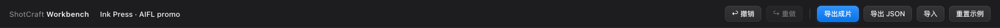
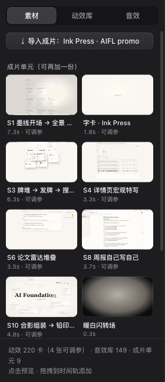
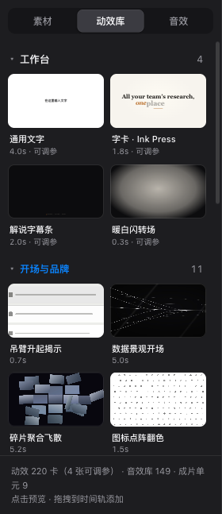
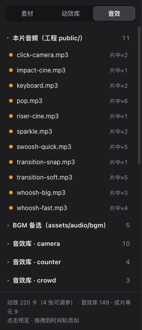
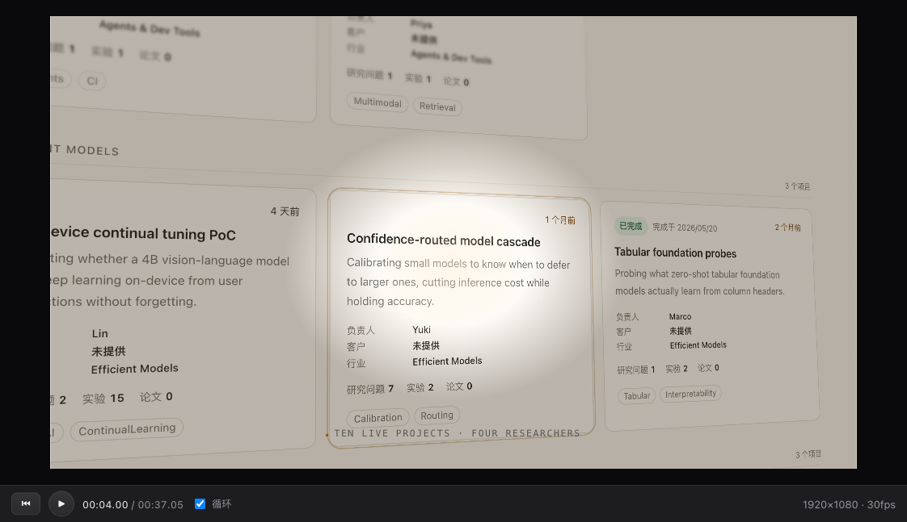
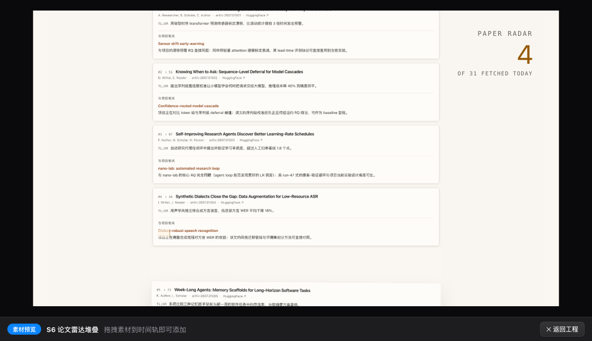
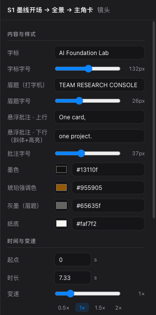
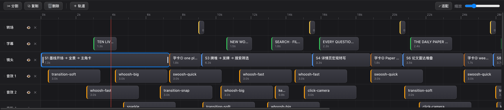

# 动效工作台 · 图文指南

成片交付后，在浏览器里继续改：镜头挪位、变速、换字、调色、加动效、加音效，改完一键导出。
本页按界面区域介绍每个功能。接入契约与制作规范见 [references/workbench.md](../references/workbench.md)，
技术说明见 [workbench/README.md](README.md)。

## 怎么打开

skill 在交付收尾时会自动执行下面这条命令并打开浏览器；也可以随时手动运行：

```bash
node workbench/scripts/open.mjs <成片工程目录>     # 首次运行会自动安装依赖
```

- 地址固定为 `http://localhost:5198/`，带 `?import=project` 打开时会按成片清单把片子拆成多轨。
- 同一版成片再次打开时保留你上次的改动；成片代码变了（清单内容哈希不同）才重新导入，旧改动压进撤销栈，⌘Z 可找回。
- 所有改动自动保存在浏览器本地（localStorage），关页不丢。停止服务：`kill $(cat workbench/.dev.pid)`。

## 界面总览


五个区域，从左到右、从上到下：

| 区域 | 位置 | 干什么 |
|---|---|---|
| 顶栏 | 顶部 | 工程名、撤销 / 重做、导出成片、导出 / 导入 JSON、重置示例 |
| 素材库 | 左栏 | 成片单元、工程素材、216 张 demo 动效、音效与 BGM；点击预览、拖拽上轨 |
| 预览 | 中央 | Remotion Player 实时预览 + 走带控制 |
| 属性面板 | 右栏 | 选中片段的文案 / 字号 / 颜色、时间与变速、图层 |
| 时间轨 | 底部 | 多轨编辑：挪动、裁边、分割、复制、变速、层序 |

三条分隔线都可拖动，调整左右栏宽度和时间轨高度，尺寸会记住。

## 顶栏



- **工程名**：直接点击编辑，导出的 MP4 / JSON 文件名用它。
- **撤销 / 重做**（⌘Z / ⇧⌘Z）：每次编辑手势一步；同一控件 0.8 秒内的连续输入合并为一步。
- **导出成片**：把当前工程交给 dev server 用 Remotion 渲染，按钮上显示进度百分比；完成后变成「✓ 已导出 · 显示文件」，点它在 Finder 里定位 MP4（输出在 `workbench/exports/`）。导出时长精确到最后一个片段结束。
- **导出 JSON / 导入**：工程是一份 JSON，可以存档、发给别人、或贴进 Remotion Studio 的 Props 面板。
- **重置示例**：换回内置演示工程（可撤销）。

## 素材库

三个 tab，所有条目都是**点击 = 在中央预览，拖到时间轨 = 添加片段**。

### 素材



- **导入成片**：按成片工程的 `src/workbench.ts` 清单重新拆解导入（一步撤销）。
- **成片单元（可再加一份）**：片子里的每种镜头、字卡、字幕条、转场各是一张卡，标着时长与「可调参」。想在别处再来一段同款字卡，拖一份上轨即可。
- **素材文件（工程 public/）**：成片工程自带的图片、视频，按目录折叠分组。

### 动效库



- 「工作台」组是 4 张原生参数化卡：通用文字、Ink Press 字卡、解说字幕条、暖白闪转场，文案颜色字号全部可调。
- 下面按画廊分类列出全部 **216 张 demo 动效**（开场与品牌、文字排版、数据图表……）。缩略图是定妆帧，**鼠标悬停才循环播放**，不会满屏乱闪。
- 标签写着卡片时长；标「可调参」的卡在属性面板里有内容与样式栏。demo 卡上轨后可裁剪、变速、定格、做图层变换。

### 音效



- **本片音频**：成片工程 `public/` 里的音效，右侧「片中 ×N」是原片里的使用次数。
- **BGM 备选**与**音效库**（149 条，按 camera / counter / crowd… 分类折叠）来自仓库 `assets/audio/`。
- 音频片段上轨后可裁入、变速（playbackRate）、调音量，不会哑音。

## 预览与走带



- 中央是 Remotion Player，画面与最终渲染逐帧一致（像素级校验过）；改属性面板或拖动片段，预览即时跟随。
- 走带条：⏮ 回到开头、▶ / ⏸ 播放（空格）、时间码（秒.帧 / 总长）、循环开关、画幅与帧率。
- 点击画面本身也能播放 / 暂停；← / → 逐帧步进，按住 Shift 一次 10 帧。
- 点素材库任意条目会切到**素材预览**模式，单独循环播放这张卡；点「返回工程」回到时间轴预览：



## 属性面板



选中时间轨上的片段后，右栏分三节：

- **内容与样式**：由卡片声明的 schema 自动生成——文本、多行文本、滑杆、颜色、下拉、开关。成片里的镜头把语境级参数（字标、眉题、批注、字号、墨色、琥珀强调色、纸底……）都暴露在这里；动效节奏（弹入时长、缓动、相机路径）故意不暴露，避免调坏品相。
- **时间与变速**：起点、时长（秒）、变速滑杆与 0.5× / 1× / 1.5× / 2× 快捷键、裁入点、「↺ 恢复原始时长」。卡片帧率与工程帧率不一致时这里会有一行提示。
- **图层**：不透明度、缩放、位移 X / Y。

底部「删除片段」等价于 Delete 键。

## 时间轨



- **工具条**：✂ 分割（S，在播放头处切开选中片段）、复制（⌘D，接在原片段之后）、删除（Delete）、+ 轨道（加在最上层）、适配（缩放到刚好看全）、缩放滑杆。
- **轨道头**：拖动左侧把手上下调整层序（上层盖住下层）；👁 隐藏 / 显示整轨；× 删除轨道。导入成片时轨序与原片 z 序一致：转场 > 字幕 > 叠加层 > 镜头 > 音乐 > 音效。
- **片段**：拖动本体挪位置（自动吸附到其他片段的起止点）、上下拖到别的轨、拖两侧把手裁边（左边裁入、右边裁出）；片段上的徽标显示时长、变速倍率、裁入秒数、不透明度。
- **标尺**：点击或拖动标尺跳转播放头；红线是当前播放头。
- 同轨允许片段重叠（层级用多轨表达）。

## 快捷键

| 键 | 作用 |
|---|---|
| 空格 | 播放 / 暂停 |
| ← / → | 逐帧步进；按住 Shift 一次 10 帧 |
| S | 在播放头处分割选中片段 |
| ⌘D | 复制选中片段 |
| Delete / Backspace | 删除选中片段 |
| ⌘Z / ⇧⌘Z | 撤销 / 重做 |

## 一次典型的修改

1. 交付后工作台自动打开，片子已拆好在时间轨上。
2. 点时间轨上的「S1 墨线开场」，右栏把「字标」改成新品牌名、拖大「字标字号」，预览立刻更新。
3. 觉得某段字幕太早，直接拖字幕片段挪后一点；想让镜头慢一点，变速滑到 0.8×。
4. 从「动效库」拖一张「数据晨光开场」到最上层轨道当片头，从「音效」拖一条 whoosh 对齐它的起点。
5. 点「导出成片」，等进度走完，「显示文件」拿到 MP4。

## 进阶

- 让自己的成片能被逐属性编辑：镜头组件把语境参数做成 props + schema、写一份 `src/workbench.ts` 清单，见 [references/workbench.md](../references/workbench.md) §2–§3。
- 验证拆解无损：`cd workbench && npm run parity`，逐帧比对导入结果与原片。
- Remotion Studio 视角：`cd workbench && npm run studio`，每张卡都是一个合成，Props 面板与工作台 schema 同源。
