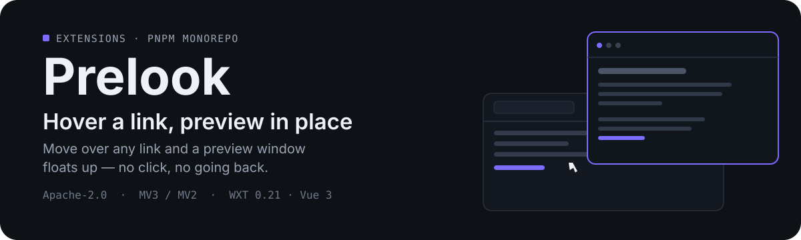
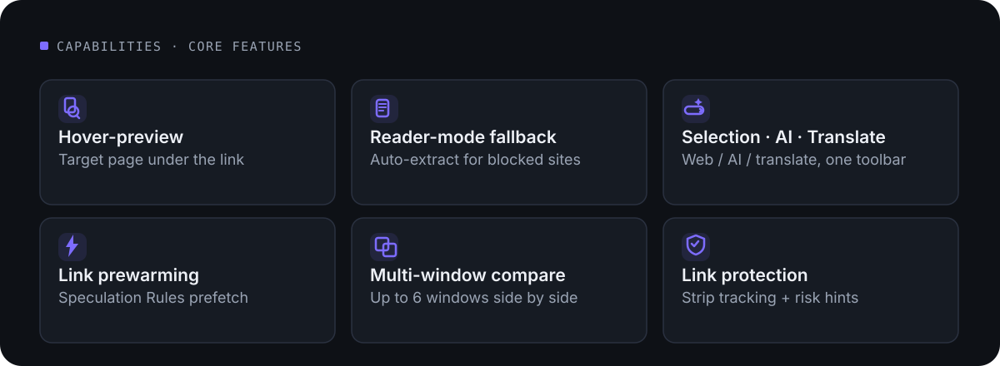
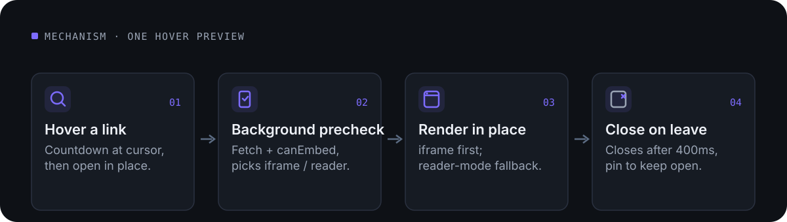

<p align="center">
  
</p>

English · [简体中文](README.md)

# What this is

**extensions** is a browser-extension monorepo (pnpm workspace), organized as “one directory per product”: the extension itself plus its landing page.

| Directory | Product |
| --- | --- |
| [`apps/prelook/`](apps/prelook/) | **Prelook** — hover-link preview extension (Chrome / Edge MV3, Firefox MV2) |
| [`apps/prelook-landing/`](apps/prelook-landing/) | **Prelook landing page** — static marketing site (zero build, deploy the directory as-is) |

**Prelook** turns “click, then come back” into “see it on hover”: move the cursor over any link and a preview window floats up with the target page — no need to click away or leave the page you are on. Everything is free: no account, no server, no paid tier.

---

## Core capabilities

<p align="center">
  
</p>

Plus a wide range of customization: trigger modes (hover / Alt+hover / long-press / drag a link), close triggers (click outside / move away / scroll), window size and position (including a sidebar dock), 8 window-theme presets with a custom color, light/dark theme, background blur, and a power-saver mode that also reduces motion.

---

## Mechanism: one hover preview

<p align="center">
  
</p>

- **iframe first**: when the target page can be embedded, it is rendered directly; sites that block embedding (`X-Frame-Options` / CSP) automatically fall back to a reader mode that extracts the article and sanitizes it (the `sanitize()` in `extract.ts` is the security boundary).
- **Hover-aware**: leaving the cursor gets a 400ms grace before the window auto-closes, so it does not flicker when the pointer crosses a seam; click the pin to keep the window open.
- **Privacy, locally**: tracking-parameter stripping and link-risk hints all run on-device — hints only, never interception.

---

## Quick start

Run from the **repository root** (scripts are forwarded to sub-packages via `pnpm -F`):

```bash
pnpm install               # install & link the workspace (required after a fresh clone / rename)
pnpm dev:prelook           # Chrome dev mode (apps/prelook/.output/chrome-mv3-dev/)
pnpm dev:prelook:firefox   # Firefox dev mode (firefox-mv2-dev/)
pnpm build:prelook         # production build (pnpm build aggregates all packages)
pnpm compile:prelook       # type check (vue-tsc --noEmit; pnpm compile aggregates)
pnpm zip:prelook           # build the store zip (zip:prelook:firefox likewise)
pnpm landing:prelook       # landing dev server http://127.0.0.1:4173 (CSS hot-updates in place)
```

> Each workspace package’s `postinstall` (`wxt prepare`) generates `apps/<name>/.wxt/tsconfig.json`, which `tsconfig.json` `extends` — **compiling before `pnpm install` fails**.

**Multi-browser development**: `webExt.binaries` in `wxt.config.ts` is keyed by the browser name passed via `-b`. To add a browser, add a key with the same name plus a `dev:<name>` script in the root package.json; anything that is not firefox/safari builds as MV3. Zen Browser is the one exception (a Firefox engine): point `binaries.firefox` at the Zen binary and run `wxt -b firefox`.

---

## Tech stack

| Area | Choice | Version |
| --- | --- | --- |
| Package management | pnpm (workspace) | 12 |
| Extension framework | WXT | ^0.21.3 |
| UI | Vue | ^3.5.29 |
| Build / dev server | Vite | ^8.1 (landing ^8.3) |
| Language | TypeScript (`vue-tsc` type check) | ^5.9.3 |
| Browser targets | Chrome / Edge (MV3), Firefox (MV2, web-ext) | ^10.5.0 |
| Icon generation | `@wxt-dev/auto-icons` | ^1.1.2 |
| Analytics (optional) | `@wxt-dev/analytics` | ^0.5.6 |
| Quality tools | `oxlint` / `oxfmt`, release-it | ^1.83 / ^0.68 |

The landing page has **zero runtime dependencies**: plain HTML/CSS/JS, with Vite used only as a dev server (`appType: 'mpa'`) and no build step — `index.html` / `privacy.html` + `css/` `js/` `assets/` are the deployment artifacts as-is.

---

## Directory structure

```
apps/
  <name>/                    # the extension; package @extensions/<name>; @/ alias points here
    wxt.config.ts            # the single source of the manifest (permissions/name/description/action)
    entrypoints/
      background.ts          # SW: fetch precheck, open tabs (message hub)
      content.ts             # hover/click/long-press detection + Shadow UI assembly
      sidepanel/             # settings panel (sidebar, opened from the toolbar icon)
    components/              # cross-entry components (SponsorSection.vue)
    utils/                   # storage / preview / selection / extract / speculation / i18n / tracking / safety / theme / power
    public/_locales/         # UI strings zh_CN/messages.json + en/messages.json
    assets/icon.png          # the single icon source (auto-icons generates all sizes)
    test/                    # repro-hover.html regression page, demo/ recording rig
  <name>-landing/            # the landing page; package @extensions/<name>-landing
    index.html privacy.html  css/ js/ assets/  vite.config.js
```

---

## Development workflow

- Per-product scripts are in “Quick start”; `pnpm compile` / `pnpm build` aggregate all packages.
- **Adding a new extension**: create `apps/<name>/` (copy the prelook skeleton) → update the manifest in `wxt.config.ts` and the package name (`@extensions/<name>`) → register `dev/build/zip/compile/landing:<name>` scripts in the root package.json → create `apps/<name>-landing/` → copy the extension’s `assets/icon.png` into the landing `assets/`.
- **Releases**: `release-it` only cuts a `prelook-v*` tag (`release: false`); `.github/workflows/release.yml` — on push of that tag — verifies the version matches, runs the type check, builds `zip:prelook` + `zip:prelook:firefox`, uploads the zips as run artifacts and attaches them to a draft release (store auto-submit is commented out for now).

---

## Coding conventions (key rules)

- **The `tp-` prefix is the former name TabPeek and is kept on purpose** (200+ preview-window CSS variables/classes/host attributes, all inside shadow DOM and invisible to users). Only externally visible identifiers follow the rename: package name, storage key `local:prelook_settings`, message prefix `prelook:`, host tag `prelook-ui`, etc.
- **i18n**: strings live in `public/_locales/zh_CN/messages.json` and `en/messages.json`, read via `browser.i18n`. Call sites use flat dot keys; `_locales` keys are the underscore form (`preview.close` → `preview_close`) — change either side together; zh_CN and en must always stay in sync. Language follows the browser UI and cannot be switched at runtime.
- **Settings & storage**: `settingsItem = local:prelook_settings`. Adding a setting means touching `PrelookSettings` + `DEFAULT_SETTINGS` + `clampSettings`, plus a control in the settings panel and a string in both locales. Every read of settings must go through `clampSettings`; delay settings are stored in milliseconds and converted to seconds in the panel.
- **Manifest**: permissions/names are changed only in each app’s `wxt.config.ts`; `.output/` and `.wxt/` are generated — do not edit them. `storage` / `browser` are WXT auto-imported globals; use them directly.
- **Content safety**: reader-mode body is injected into shadow DOM via `innerHTML`, so `sanitize()` in `extract.ts` is the security boundary (allow-listed attributes, strips `javascript:` links, resolves relative URLs) — never weaken it.
- **Quality**: `oxlint` / `oxfmt` for lint and format; `vue-tsc --noEmit` for type checking.

---

## Testing

The project has **no automated test framework** (no test script in the root package.json); regression relies on type checking plus a manual repro page:

```bash
pnpm install && pnpm compile:prelook && pnpm build:prelook   # type + build

# locale-parity check (zh_CN and en key sets must match)
node -e "const a=Object.keys(require('./apps/prelook/public/_locales/zh_CN/messages.json')).sort(),b=Object.keys(require('./apps/prelook/public/_locales/en/messages.json')).sort();console.log('zh-only',a.filter(k=>!b.includes(k)),'en-only',b.filter(k=>!a.includes(k)))"
```

- **Hover-path regression**: after touching `entrypoints/content.ts` / `utils/preview.ts`, run `pnpm build:prelook` first, then serve the repo **root** and open `apps/prelook/test/repro-hover.html` (the page mocks the chrome API and loads the real `.output` build); confirm the log shows `windows in shadow: 1`.
- **Release build**: pushing a `prelook-v*` tag in `release.yml` runs `pnpm compile` first (so shipped zips always compile), then builds both browser zips and attaches them to the draft release.
- Note: under headless + `--virtual-time-budget`, the browser dispatches no scroll events and does not advance CSS transitions — verify scroll-related behavior in real-time mode.

---

## Contributing / adding an extension

See the “Adding a new extension” checklist under Development workflow. When changing code, follow the Coding conventions: keep the two locales in sync, route settings through `clampSettings`, change the manifest only in `wxt.config.ts`, and never introduce host-page dependencies into shadow DOM. Always run the `repro-hover.html` regression after touching the hover/preview path.

---

## Sponsorship

Prelook’s only revenue is sponsorship (there is no paid tier):

- Ko-Fi — <https://ko-fi.com/coldstoneboy>
- 爱发电 (Aifadian) — <https://ifdian.net/a/coldstoneboy>

Entries live at the bottom of the settings panel (`SponsorSection.vue`) and in the landing page’s `#sponsor` section and footer.

---

## License

Licensed under the **Apache License 2.0** ([LICENSE](LICENSE)). See <https://www.apache.org/licenses/LICENSE-2.0>.
