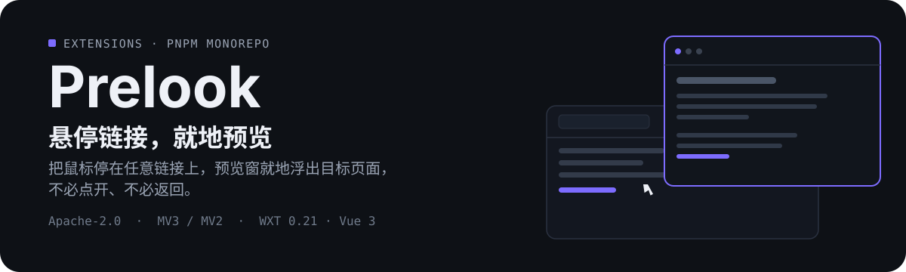
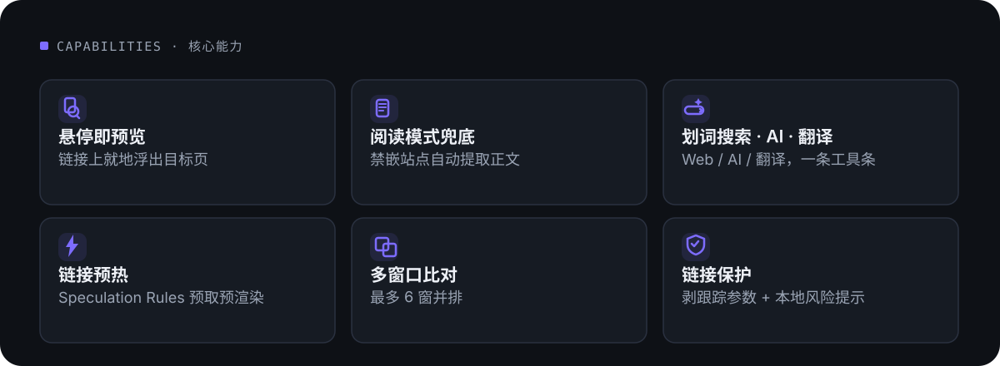
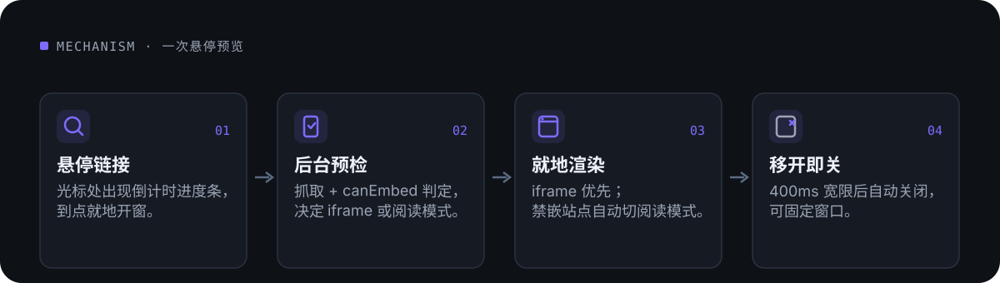

<p align="center">
  
</p>

简体中文 · [English](README.en.md)

# 这是什么

**extensions** 是一个浏览器插件 monorepo（pnpm workspace），按「每个产品两个目录」组织：插件本体 + 产品落地页。

| 目录 | 产品 |
| --- | --- |
| [`apps/prelook/`](apps/prelook/) | **Prelook** — 悬停链接预览扩展（Chrome / Edge MV3、Firefox MV2） |
| [`apps/prelook-landing/`](apps/prelook-landing/) | **Prelook 产品官网** — 纯静态落地页（零构建、整目录部署） |

**Prelook** 把「先点开、再返回」变成「悬停即见」：鼠标停在任意链接上，预览窗就地浮出目标页面；不必点开、不必离开当前页。全部功能免费，无账号、无服务器、无付费版本。

---

## 核心能力

<p align="center">
  
</p>

此外还有大量可定制项：触发方式（悬停 / Alt+悬停 / 长按 / 拖动链接）、关闭触发器（点外部 / 移开指针 / 滚动）、窗口尺寸与位置（含侧边栏停靠）、8 套弹窗主题与自定义颜色、深浅主题、背景模糊、节电模式与减少动画。

---

## 机制：一次悬停预览

<p align="center">
  
</p>

- **iframe 优先**：目标页可内嵌就直接渲染；被禁嵌站点（`X-Frame-Options` / CSP）自动切到阅读模式，提取正文并做白名单净化（`extract.ts` 的 `sanitize()` 是安全边界）。
- **就地感知**：移开指针有 400ms 宽限再自动关闭，避免「穿过缝隙」时窗口闪没；点图钉可固定窗口。
- **隐私本地化**：跟踪参数剥离与链接风险提示都在本地完成，只提示、不拦截。

---

## 快速开始

在**仓库根目录**执行（脚本经 `pnpm -F` 转发到子包）：

```bash
pnpm install               # 安装并链接 workspace（首次克隆/目录改名后必跑）
pnpm dev:prelook           # Chrome 开发模式（apps/prelook/.output/chrome-mv3-dev/）
pnpm dev:prelook:firefox   # Firefox 开发模式（firefox-mv2-dev/）
pnpm build:prelook         # 生产构建（pnpm build 聚合全部子包）
pnpm compile:prelook       # 类型检查（vue-tsc --noEmit；pnpm compile 聚合）
pnpm zip:prelook           # 打包上架 zip（zip:prelook:firefox 同）
pnpm landing:prelook       # 官网开发服务器 http://127.0.0.1:4173（CSS 就地热更新）
```

> workspace 子包的 `postinstall`（`wxt prepare`）会生成 `apps/<name>/.wxt/tsconfig.json`，`tsconfig.json` 正是 `extends` 它——**没跑过 install 就编译会失败**。

---

## 技术栈

| 领域 | 选型 | 版本 |
| --- | --- | --- |
| 包管理 | pnpm（workspace） | 12 |
| 插件框架 | WXT | ^0.21.3 |
| UI | Vue | ^3.5.29 |
| 构建 / 开发服务器 | Vite | ^8.1（落地页 ^8.3） |
| 语言 | TypeScript（`vue-tsc` 类型检查） | ^5.9.3 |
| 浏览器目标 | Chrome / Edge（MV3）、Firefox（MV2，web-ext） | ^10.5.0 |
| 图标生成 | `@wxt-dev/auto-icons` | ^1.1.2 |
| 分析（可选） | `@wxt-dev/analytics` | ^0.5.6 |
| 质量工具 | `oxlint` / `oxfmt`、release-it | ^1.83 / ^0.68 |

落地页运行期**零依赖**：纯 HTML/CSS/JS，Vite 只作开发服务器（`appType: 'mpa'`），不产生构建产物——`index.html` / `privacy.html` + `css/` `js/` `assets/` 原样即部署物。

**多浏览器开发**：`wxt.config.ts` 的 `webExt.binaries` 按 `-b` 传入的浏览器名取值，新增浏览器在 `binaries` 加一条同名键 + 根 package.json 加一个 `dev:<name>` 脚本即可；非 firefox/safari 一律按 MV3 构建。Zen Browser 是例外（Firefox 内核）：把 `binaries.firefox` 指向 Zen 主程序，用 `wxt -b firefox`。

---

## 目录结构

```
apps/
  <name>/                    # 插件本体，包名 @extensions/<name>；@/ 别名指到这里
    wxt.config.ts            # manifest（权限/名称/描述/action）唯一定义处
    entrypoints/
      background.ts          # SW：fetch 预检、开标签页（消息中枢）
      content.ts             # 悬停/点击/长按判定 + Shadow UI 装配
      sidepanel/             # 设置面板（侧边栏，点工具栏图标打开）
    components/              # 跨入口复用组件（SponsorSection.vue）
    utils/                   # storage / preview / selection / extract / speculation / i18n / tracking / safety / theme / power
    public/_locales/         # 界面词条 zh_CN/messages.json + en/messages.json
    assets/icon.png          # 唯一图标源图（auto-icons 生成各尺寸）
    test/                    # repro-hover.html 回归页、demo/ 演示视频录制台
  <name>-landing/            # 落地页，包名 @extensions/<name>-landing
    index.html privacy.html  css/ js/ assets/  vite.config.js
```

---

## 开发工作流

- 单产品脚本见「快速开始」；`pnpm compile` / `pnpm build` 聚合全部子包。
- **新增插件接入**：建 `apps/<name>/`（可复制 prelook 骨架）→ 改 `wxt.config.ts` manifest 与包名（`@extensions/<name>`）→ 根 package.json 注册 `dev/build/zip/compile/landing:<name>` 脚本 → 建 `apps/<name>-landing/` → 把插件 `assets/icon.png` 复制一份到 landing `assets/`。
- **发布**：`release-it` 只切 `prelook-v*` tag（`release: false`）；`.github/workflows/release.yml` 在 push 该 tag 时校验版本一致性 → 类型检查 → `zip:prelook` + `zip:prelook:firefox` → 产物作为 run artifact 并挂到 draft release（商店自动提交已注释，暂未启用）。

---

## 编码约定（关键约定）

- **`tp-` 前缀是曾用名 TabPeek 的缩写，刻意保留**（预览窗的 CSS 变量/类名/host 属性共 200 多处，全在 shadow DOM 内、用户看不见）。外部可见标识符才随改名走：包名、存储键 `local:prelook_settings`、消息前缀 `prelook:`、host 标签 `prelook-ui` 等。
- **i18n**：词条在 `public/_locales/zh_CN/messages.json` 与 `en/messages.json`，经 `browser.i18n` 读取。调用点写扁平点号 key，`_locales` 里键为下划线形式（`preview.close` → `preview_close`），改任一边都要同步；zh_CN 与 en 必须同时补齐。语言跟随浏览器 UI，运行时不可切换。
- **设置与存储**：`settingsItem = local:prelook_settings`。新增设置项要同时改 `PrelookSettings` + `DEFAULT_SETTINGS` + `clampSettings`，并在设置面板加控件、两个 locale 补词条。所有读取设置的地方都要过 `clampSettings`；延迟类设置存储恒为毫秒，面板再换算成秒。
- **manifest**：权限/名称只改各 app 的 `wxt.config.ts`；`.output/`、`.wxt/` 是生成物，不要编辑。`storage` / `browser` 是 WXT 自动导入的全局，直接裸用。
- **内容安全**：阅读模式的正文是 `innerHTML` 直接注入 shadow DOM，`extract.ts` 的 `sanitize()` 是安全边界（白名单属性、剥 `javascript:`、相对 URL 补全），不得削弱。
- **质量**：`oxlint` / `oxfmt` 用于 lint 与格式化；`vue-tsc --noEmit` 做类型检查。

---

## 测试

项目**没有自动化测试框架**（根 package.json 无 test 脚本），回归靠类型检查 + 手动复现页：

```bash
pnpm install && pnpm compile:prelook && pnpm build:prelook   # 类型 + 构建

# 词条对齐检查（zh_CN 与 en 键集合一致）
node -e "const a=Object.keys(require('./apps/prelook/public/_locales/zh_CN/messages.json')).sort(),b=Object.keys(require('./apps/prelook/public/_locales/en/messages.json')).sort();console.log('zh-only',a.filter(k=>!b.includes(k)),'en-only',b.filter(k=>!a.includes(k)))"
```

- **悬停链路回归**：改 `entrypoints/content.ts` / `utils/preview.ts` 后先 `pnpm build:prelook`，再从**仓库根目录**起静态服务器打开 `apps/prelook/test/repro-hover.html`（页面 mock chrome API + 引用 `.output` 真实产物），确认日志出现 `windows in shadow: 1`。
- **发布构建**：`release.yml` 里 push `prelook-v*` tag 时会先跑 `pnpm compile`（保证上架产物可编译），再打两个浏览器的 zip 并挂到 draft release。
- 注意：无头 + `--virtual-time-budget` 下浏览器不派发 scroll 事件也不推进 CSS 过渡，验证滚动相关行为要用实时模式。

---

## 贡献 / 新插件接入

见「开发工作流」的新插件接入清单。改代码时请遵守「编码约定」：词条双语同步、设置走 `clampSettings`、manifest 只动 `wxt.config.ts`、不在 shadow DOM 里引入宿主页面依赖。悬停/预览链路改动务必跑一遍 `repro-hover.html` 回归。

---

## 赞助

Prelook 收入来源只有赞助（无付费版本）：

- Ko-Fi — <https://ko-fi.com/coldstoneboy>
- 爱发电 — <https://ifdian.net/a/coldstoneboy>

入口在设置面板底部（`SponsorSection.vue`）与落地页 `#sponsor` 段 + 页脚。

---

## License

本仓库采用 **Apache License 2.0**（[LICENSE](LICENSE)）。详见 <https://www.apache.org/licenses/LICENSE-2.0>。
